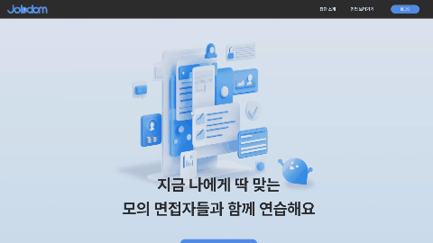
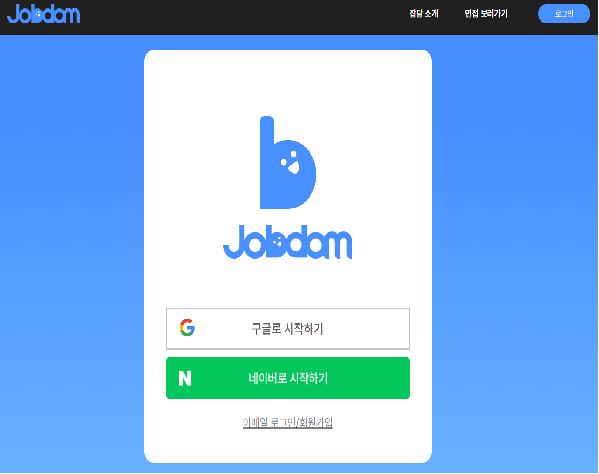
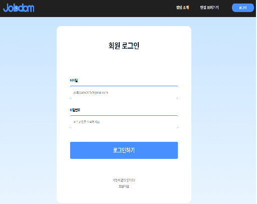
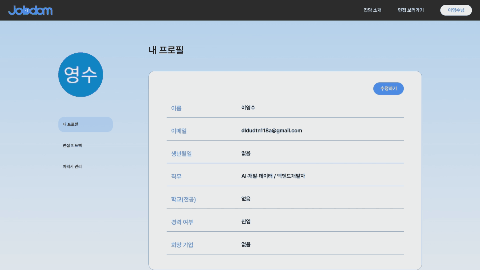
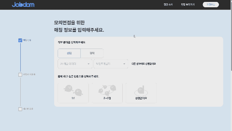
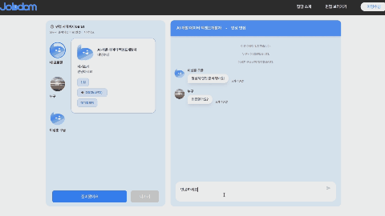
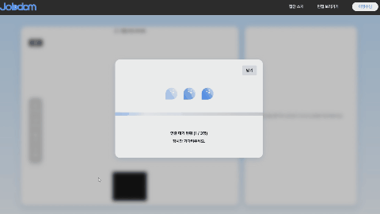
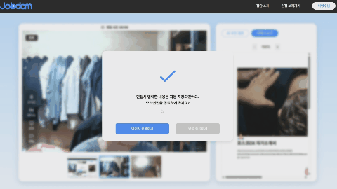

# JOBDAM - Ai 기반 실시간 모의면접 매칭 서비스

## 📝 개요

### 목적
모의 면접의 '번거로움'을 없애고, '효율적인 준비'를 돕는 실전형 플렛폼

### 타겟
취준생, 이직자 등 취업대상자

### 기능 및 특징
1. 유저들끼리 매칭을 통해 모의면접을 진행한다. 
  - 이 과정에서 면접자+면접관 역할을 동시에 수행할 수 있다.(면접관 간접체험가능) 
2. 이력서를 업로드하면 AI가 추천질문을 생성해준다.
3. 화상 모의면접이 끝나면 피드백을 AI가 분석해준다.

## 🛠️ 기술스택

### **Frontend**
- React 19, TypeScript, Vite
- Redux Toolkit(slice사용용), React Query
- TailwindCSS, Chakra UI, Radix UI, Lucide React
- React Hook Form, Zod
- react-pdf, @react-pdf-viewer (PDF 뷰어)
- Storybook (컴포넌트 문서화/테스트)

### **Infra & DevOps**
- **AWS**
  - EC2 (백엔드 서버)
  - S3 (정적 파일, 프론트엔드 배포)
  - CloudFront (CDN, HTTPS)
  - Route 53 (DNS)
  - RDS (MySQL 관리형 DB)
- Nginx (리버스 프록시, TLS/HTTPS 인증서 관리)
- Let's Encrypt (무료 TLS 인증서)
- Coturn (STUN/TURN 서버 – WebRTC NAT traversal)

## 🚩 주요 화면 및 기능
### **메인 페이지**  

### **로그인** 

### **이력서 업로드** 

1. 이력서 업로드 시 AI가 이력서를 분석하여 추천 질문 5가지를 뽑아준다.
2. pdf형식으로만 업로드 가능하며 s3에 저장한다.
### **매칭 페이지** 

1. 매칭 조건은 신입/경력, 직군, 세부직군, 매칭인원수(1:1,3~6,상관없음) 4가지이며
2. 신입/경력과 세부직군은 서브조건으로 3분뒤에 완화된다.
3. 인원수 상관없음은 1:1이나 3~6명 상관없이 선택된다.
4. 3~6명방은 3명의 인원수가 모일 시 3명채팅방이 개설되어 진입하게 되며
5. 방에 추가인원이 들어오는 식으로 구성되어 있다.
6. 방에서 나가면 같은방에는 1분뒤에 재입장이 된다.
### **채팅 페이지** 

1. 매칭이 완료되면 채팅방에 진입을 하게된다.
2. websocket을 통해 실시간 채팅이 이루어지며,
3. 상대방의 간단한 profile을 확인할 수 있다.
4. 모두준비가 완료되거나 10분이 지날 시 화상면접이 시작된다.
### **화상 모의면접 페이지** 

1. 비디오 패널에서는 마이크토글, 화면토글, 화면공유, 간단한채팅을 할 수 있다.
2. 비디오 패널의 썸네일을 클릭 시 
3. 우측 인터뷰뷰패널에서 상대방의 ai질문을 확인하여 피드백남기기, 추가 질문생성을 할 수 있으며,
4. 상대방의 이력서를 확인 할 수 있다.
### **피드백 페이지** 

1. 화상채팅 종료시 피드백 페이지로 이동하게 된다.
2. 상대방이 남긴 피드백을 AI가 분석하여 잘한점 및 개선할점을 간략하게 정리해준다.
3. 작성된 피드백들을 타임라인으로 확인을 할수 있다.(무한스크롤적용)

   
## 🧑‍💼 담당 역할
- 팀원 : 디자이너 1, 프론트1, 백앤드 2(3명이였으나 한분이 기획까지만 하시고 그만 둠) 
- 맡은 역할 : 매칭, 채팅, 화상채팅(시그널서버), 피드백확인
             aws배포담당
  
## 🤔 문제점 
### 새고로침 및 끊김과 나가기 구분
1. 단순히 채팅방을 나갔다 들어왔다 하는 것이 아닌 동시에 채팅방이나 화상채팅방을 진입하고
   채팅방의 경우에는 초기매칭과 나중에 추가입장이 별도로 구분되어 있는 상태이므로
   새로고침이나 인터넷 끊김이 발생되면 새로 웹소켓을 연결하고 구독을 진행하여야한다. 
   이때 초기입장과 새로고침을 구분하지 않으면 동기화처리, 중복메세지등 여러 문제가 발생

2. 해결 방법
   - location.state를 사용하여 이전페이지에서 전달한 값이 존재하는지 파악해서
   - 새로고침 유무를 확인하여 로직을 작성

### webRTC test문제
1. webRTC특성상 ip를 파악하고 마이크,카메라허용 등의 이유로 https가 필수였다.
   그래서 로컬에서 혼자 테스트가 어려웠다.(엣지,크롬,웨일등 다수 브라우저로 테스트)
   우선 로컬에서 테스트시 단일ip사용으로 coturn서버 정상 작동 확인 힘들었다.
   그리고 카메라는 단하나의 브라우저에서만 허용되어 정상적으로 track이 들어오는지 확인이 어려웠다.
     
2. 해결 방법
    - cotrun서버에도 마찬가지로 tls를 적용해야되므로 별도의 사이트에서 잘 작동하는지 체크
    - https://webrtc.github.io/samples/src/content/peerconnection/trickle-ice/
    - 카메라 마이크 등은 fake track을 만들어 없으면 검은화면이 나오게해서 테스트를 진행함.
    - 또한 중간중간 배포를 하여 팀원들에게 테스트요청을 하여
    - 제대로 카메라가 나오는지, 동기화가 잘되는지, 새로고침시 어떻게되는지 등 여러번 테스트를 진행 

### webRTC 시그널 동기화문제
1. sfu를 사용하지않아 n:m 화상채팅진행시 시그널링서버(p2p2연결 중계역할)를 통해 webrtc를 연결해야 했다.
   기획 의도는 채팅방에서 화상채팅으로 한번에 넘어가야했기 때문에 동시성이슈가 많이 발생했다.
   우선 동시접속시 offer를 중복으로 보낸다던가(a->b b->a 둘다 offer), 같은 인원에게 offer를 2번보내지는 등의
   이슈가 많이 발생하였다.
      
2. 해결방법(broadcast,1:1용 2개 구독)
   - 우선 초기입장시에는 방에존재하는 유저전원에게 방유저 목록을 보내준다.
   - 프론트에서 p2p 상대방 유저 저장시 중복을 체크하고 아이디가 본인보다 큰 유저에게만 offer를 보낸다.
   - 마지막으로 일정시간지난뒤 list전체를 한번더 보내주어 연결확인을 체크한다.(안되어있으면 추가연결)
   - 새로고침시에는 초기입장과 달리 새로고침한 인원에게만 sendTouser로 자신제외 유저전체목록을 보내주어
   - offer를 보내게하여 해결
     
## 💬 회고
스위프 웹9기에 참여하여 진행한 프로젝트

### 1. 기획 및 사전조사의 중요성
- **AI 비용 문제를 간과**  
  - 이력서 분석 등 AI API 사용 시, 건당 수십 원의 비용이 발생하는 것을 프로젝트 중간에야 알게 됨  
    API사용 말고 직접 모델을 구축하면 서버(특히 고성능 GPU) 비용 부담이 큼  
  - 단기적으로는 스위프 지원으로 네이버 Clova API를 무료로 활용하여 해결  
  - 장기적으로는 **결제 시스템** 도입 등 비용 회수 방안이 필요함을 느낌

- **초기 유저 수 부족 시 매칭의 한계**  
  - 단순 “실시간 매칭”만으로는, 일정 인원 이하에서는 매칭이 거의 불가능하거나 대기 시간이 길어짐  
  - 해결 방안으로,  
    - **면접관/면접자 역할을 명확히 구분**하고  
    - 면접자가 원하는 면접관에게 직접 신청하는 방식  
    - 또는 매칭 시간을 넉넉히 주고, 매칭이 되면 문자/카톡 등으로 알림을 보내주는 방식 등을  
      차후 개선 방향으로 논의함

### 2. 초반에 설계의 중요성
- **type 설계 미흡**
  - 프론트엔드와 백엔드 간에 데이터 타입을 명확하게 맞추지 않고 개발을 진행하다 보니,
    서로 다른 타입의 데이터를 주고받으며 잦은 버그와 혼란이 발생했다.
  - 이를 통해, 개발 초기에 명확한 타입 설계와 팀원 간 소통이 매우 중요하다는 점을 깨달았다.

### 3. 프로젝트를 마치며

비록 팀 인원이 부족했지만, 끝까지 포기하지 않고 협력하여 프로젝트를 무사히 완주할 수 있었다.  
온라인 협업이 처음이라 소통이 잘 안될까 걱정했지만, 예상과 달리 팀원 간 의사소통이 매우 원활했고,  
질문을 남기면 거의 즉시 답변이 올 정도로 활발하게 소통하는 경험을 할 수 있었다.  

프로젝트 수료식 날, 다른 팀의 이야기를 들어보니 답변이 느려 어려움을 겪은 경우도 많았다고 한다.  
소통이 잘 되는 팀원들을 만나 다행이라고 느꼈고,  
프로젝트에서 가장 중요한 것은 **커뮤니케이션**임을 다시 한 번 깨달았다.

프론트엔드에서는 webRTC, redux, react-query, tailwindCSS, react-auth 등 
다양한 기술을 접할 수 있게 되어 뜻 깊은 프로젝트가 되었다.
